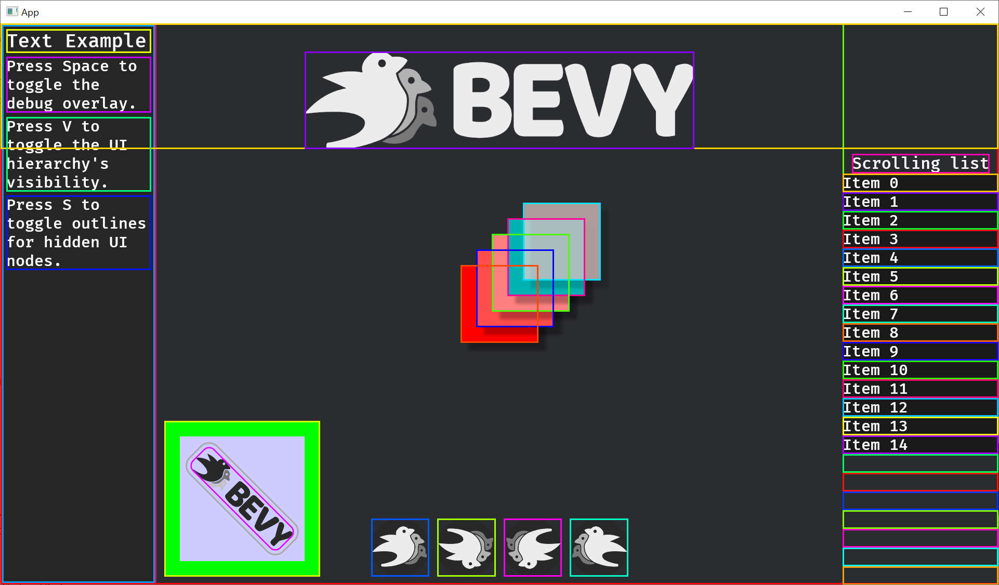

# bevy-ui-debug-overlay

Improved UI debug overlay for Bevy 0.15. 
Simpler, more efficient, and easier to use than the built-in `bevy_dev_tools::ui_debug_overlay`.
* Supports multiple windows and UI rendered to texture.
* Supports UI scale factor correctly.
* Draws rounded debug rects for rounded UI nodes.


### Usage

Add the dependency to your project's `cargo.toml`:
```
bevy-ui-debug-overlay = "0.1"
```

Add the plugin to your bevy project :
```
// This is from the `debug_overlay.rs` example included with this crate.
fn main() {
    App::new()
        .add_plugins((DefaultPlugins, UiDebugOverlayPlugin))
        .add_systems(Startup, (setup, debug_overlay_setup))
        .add_systems(Update, (update_scroll_position, toggle_debug_overlay))
        .run();
}
```


Activate the debug overlay using the `UiDebugOverlay` resource:
```
fn toggle_debug_overlay(
    input: Res<ButtonInput<KeyCode>>,
    mut debug_overlay: ResMut<UiDebugOverlay>,
) {
    if input.just_pressed(KeyCode::Space) {
        // The toggle method will enable the debug overlay if disabled and disable if enabled
        debug_overlay.toggle();
    }
}
```

You can also use `UiDebugOverlay` to set the overlay's line width:
```
fn debug_overlay_setup(mut debug_overlay: ResMut<UiDebugOverlay>) {
    debug_overlay.enabled = true;
    debug_overlay.line_width = 2.;
}
```

### Example
To run the example use:
```
cargo run --example debug_overlay
```
Press space to toggle the example's debug overlay on and off.


